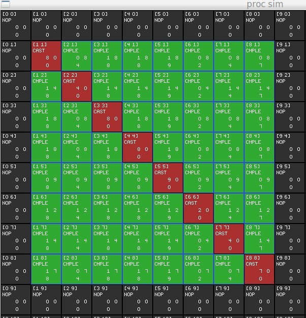

# Table of Contents

1.  [DreamCell CPU design [2016 .. ongoing]](#orgcdf78c1)
    1.  [Instructions](#org6f4f994)
        1.  [row broadcast](#org4b38001)
        2.  [column broadcast](#org2f1c9fc)
        3.  [cell register](#org92d5b79)
        4.  [neighbor communication?](#org226b22e)
    2.  [Some abstractions are an unaffordable luxery](#orga32b1db)
    3.  [Waiting for technology that doesn't exist yet](#orgdb90908)
        1.  [massive bandwidth](#orgcd12e3d)
    4.  [Philosophy](#org836e0a8)
        1.  [General purpose processor](#orge7d8b30)
        2.  [Simulating on JADE](#org8a4471c)

# DreamCell CPU design [2016 .. ongoing]

## Instructions

-   What kind of instructions are there? permutations.

### row broadcast

### column broadcast

### cell register

### neighbor communication?

-   charts, map, atlas - reuse terminology.

## Some abstractions are an unaffordable luxery

## Waiting for technology that doesn't exist yet

### massive bandwidth

possible configuration of large sections of the chip every clock cycle.

how to fill all blocks

## Philosophy

### General purpose processor

-   no specialized units.
-   reconfigurable regions finer grained than FPGA
-   Scalable congruent region configurations, a 2x2 function block has
    the same configuration as a 4x4 function block. They perform the
    same function, only differing in the width of the input.

-   Localized data into regions, like a patch space.

### Simulating on JADE

clone the current register device and set the cap to 0, risetime to 0.
the bus will for an N\*N cell there will be a N-wide bus for each row.

